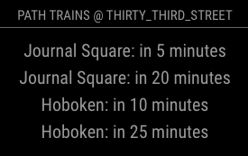

# MMM-pathtime
An unofficial Magic Mirror Module to show Port Authority Trans-Hudson(PATH) Train schedules.
This module is not endorsed nor supported by the Port Authority of NY and NJ.

## Screenshot


## Update:
Yep, the API provided by @mrazza is down. You may need to setup your own server for it.

## Installing and Config
1. in `MagicMirror/modules` 
    ```sh
    git clone https://github.com/Comf0rTS1997/MMM-pathtime.git
    ```
2. in `MagicMirror/config`, open `config.js` Add the following in `modules` array
    ```
        {
		module: "MMM-pathtime",
		position: "top_bar",
		config: {
			station: "thirty_third_street",
			interval: 30000,
			debug: false,
		}
	},
    ```
    Change position to whichever position you want.

## Options
| Field      | Description                                                                | Default                                     |
| ---------- | -------------------------------------------------------------------------- | ------------------------------------------- |
| api        | The url of the api.                                                        | "https://path.api.razza.dev/v1/stations/"   |
| station    | Which station to show the data of.                                         | "thirty_third_street"                       |
| interval   | Update interval(in milliseconds).                                          | 30000                                       |
| debug      | If the debug mode is on                                                    | false                                       |

### api
This module is based on the api provided by @mrazza [Project Link](https://github.com/mrazza/path-data), you can read more about it at [Programmatic PATH Real-time Arrival Data](https://medium.com/@mrazza/programmatic-path-real-time-arrival-data-5d0884ae1ad6#ab14)

### station
From `https://github.com/mrazza/path-data/blob/master/README.md`, station has to be one of the following:

| stations:           |
| ------------------- |
| newark              |
| harrison            |
| journal_square      |
| grove_street        |
| exchange_place      |
| world_trade_center  |
| newport             |
| hoboken             |
| christopher_street  |
| ninth_street        |
| fourteenth_street   |
| twenty_third_street |
| thirty_third_street |

### interval
You can change how often the module refresh here. Input the value in milliseconds. The default value is 30000, which is 30 secs.

## Lincense
MIT lincense

## Contribution
Post issues if you have any questions or problems about this module.
Comment, like ,and subscribe if you find this module helpful.
